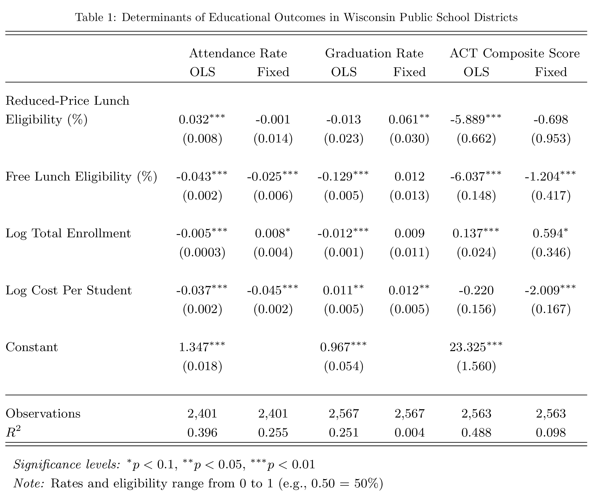
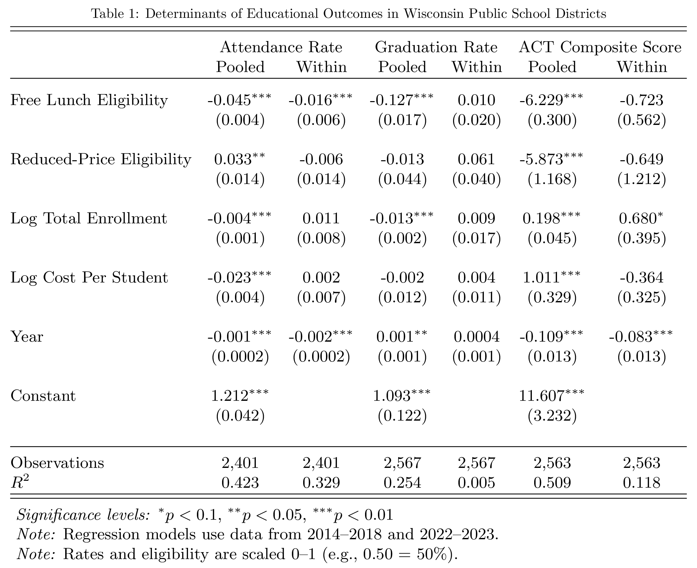

# Phase I: Original Submission

## Introduction

Access to education is widely recognized as a cornerstone of social and economic development, but significant disparities persist in how students from different socioeconomic backgrounds experience and benefit from the educational system. One key measure of socioeconomic status is eligibility for free or reduced-price lunch programs, which serve as a proxy for economic disadvantage in public schools. Understanding how socioeconomic factors influence educational outcomes is crucial for policymakers aiming to close achievement gaps and promote equity in education.

This study focuses on the relationship between the percentage of students receiving free or reduced-price lunch and student attendance rates in Wisconsin public schools. The research question guiding this analysis is: How does the socioeconomic status of students, as measured by free or reduced-price lunch eligibility, affect their attendance rates? The hypothesis is that higher percentages of students eligible for free or reduced-price lunch will correlate with lower attendance rates. This hypothesis is grounded in the theory that socioeconomic challenges—such as financial instability, lack of transportation, and health issues—can hinder a student's ability to attend school regularly.

Attendance rates are a key indicator of student engagement and academic success, and disparities in attendance can exacerbate educational inequities over time. By examining this relationship in Wisconsin, a state with diverse socioeconomic and geographic characteristics, this research aims to contribute to a better understanding of how poverty influences educational participation.

## Data Overview

The data for this analysis is sourced from the Wisconsin Department of Public Instruction (DPI), which collects annual statistics as part of its mandated reporting requirements. The key variables in this study are the percentage of students eligible for free or reduced-price lunch (independent variable) and student attendance rates (dependent variable).

The percentage of students eligible for free or reduced-price lunch is derived from annual enrollment and participation reports, which are based on annual October reimbursement claims submitted by local education agencies to the DPI. These claims provide data on meal participation by free/reduced-price categories, and the eligibility data used in this study specifically focuses on public schools at the district level. For districts participating in the Community Eligibility Provision (CEP), all students are eligible to receive free meals, which may result in a reported 100% eligibility rate.

Attendance data is obtained from WISEdata, the state’s attendance collection system. Attendance is defined as the contact between a student and a teacher during which district-supervised PK-12 educational services are provided, whether in a school building or through virtual platforms. Each school district sets its own attendance policies, and the data submitted to WISEdata reflects these policies. 

Actual days of attendance represents the number of days a student was physically or virtually present and engaged in district-supervised educational services. For example, students who participate in at least 66% of educational services in a day accrue a full day (1.0) of attendance. Possible days of attendance represents the total number of days a student could have attended during the school term, adjusted for partial-year enrollment. Attendance rates are calculated as the ratio of actual days of attendance to possible days of attendance, expressed as a percentage.

```{r, message=FALSE, warning=FALSE, results='hide'}
library(tidyverse)
library(readxl)
library(kableExtra)
library(patchwork)
library(corrplot)
library(plm)
library(lmtest)
library(sandwich)
library(modelsummary)
library(stargazer)
```

```{r, message=FALSE, warning=FALSE, results='hide'}
meals <- read_xlsx("data/eligibility_district_oct_2022-23.xlsx")
attendance <- read_csv("data/attendance/attendance_certified_2022-23.csv")

meals <- meals |> 
  mutate(District_Code = str_sub(`Agency Code`, -4))

combined <- left_join(meals, attendance, by = c("District_Code" = "DISTRICT_CODE"))

combined_all <- combined |> 
  filter(GROUP_BY_VALUE == "All Students",
         GRADE_GROUP == "[All]") |> 
  select(-"Independent Charter") |> 
  select(-(District_Code:STUDENT_COUNT)) |> 
  mutate(POSSIBLE_DAYS_OF_ATTENDANCE = as.numeric(POSSIBLE_DAYS_OF_ATTENDANCE),
         ACTUAL_DAYS_OF_ATTENDANCE = as.numeric(ACTUAL_DAYS_OF_ATTENDANCE),
         ATTENDANCE_RATE = as.numeric(ATTENDANCE_RATE),
         ATTENDANCE_RATE = ATTENDANCE_RATE / 100)
```

## Summary of Dependent Variable

```{r, message=FALSE, warning=FALSE}
ggplot(combined_all, aes(x = ATTENDANCE_RATE)) +
  geom_histogram(binwidth = 0.01, fill = "steelblue3", color = "white") +
  labs(title = "Distribution of Attendance Rates\nAcross Wisconsin School Districts",
       x = "Attendance Rate (%)",
       y = "Number of School Districts",
       caption = "Source: Wisconsin Department of Public Instruction") +
  scale_x_continuous(labels = scales::percent, limits = c(0.8, 1)) +
  theme_light() +
  theme(plot.title = element_text(size = 14, face = "bold", hjust = 0.5)) +
  theme(panel.border = element_blank())
```

## Results of Data Analysis

```{r, message=FALSE, warning=FALSE}
ggplot(combined_all, aes(x = `% Free and Reduced`, 
                         y = ATTENDANCE_RATE)) +
  geom_point(alpha = 0.5, color = "steelblue3") +  
  geom_smooth(method = "lm", se = FALSE, color = "indianred2") +
  labs(title = "Relationship Between Free/Reduced Lunch Eligibility and\nAttendance Rates in Wisconsin Public School Districts (2023)",
       x = "% of Students Receiving Free/Reduced Lunch by School District",
       y = "Attendance Rate by School District (%)",
       caption = "Source: Wisconsin Department of Public Instruction") +
  scale_x_continuous(labels = scales::percent) + 
  scale_y_continuous(labels = scales::percent, limits = c(0.8, 1)) + 
  theme_light() +
  theme(plot.title = element_text(size = 14, face = "bold", hjust = 0.5)) +
  theme(panel.border = element_blank())
```

```{r, message=FALSE, warning=FALSE}
fit_school <- lm(ATTENDANCE_RATE ~ `% Free and Reduced`, data = combined_all)
fit_school_summary <- summary(fit_school)
intercept_school <- fit_school_summary$coefficients[1, 1] 
coefficient_school <- fit_school_summary$coefficients[2, 1]  
rsquared_school <- fit_school_summary$r.squared 
pvalue_school <- fit_school_summary$coefficients[2, 4]
school_results <- data.frame(Parameter = c("Intercept", "Coefficient for % Free/Reduced Lunch", "P-value for Coefficient", "R-squared Value"),
                             Estimate = c(intercept_school, coefficient_school, pvalue_school, rsquared_school))

school_results |> 
  kable(digits = 3) |> 
  kable_styling(full_width = FALSE, position = "center", font_size = 14) |> 
  add_header_above(c(" " = 1, "Linear Model Results" = 1))
  
```


The intercept estimate predicts that a school district with 0% of students eligible for free/reduced-price lunch will have an attendance rate of 96.2%. 

The coefficient estimates that for every 1% increase in the proportion of students eligible for free/reduced-price lunch within a school district, the attendance rate decreases by 0.061%. This result supports the hypothesis that higher levels of socioeconomic disadvantaged students, as measured by lunch eligibility, are associated with lower student attendance rates.  

The p-value for the coefficient is 0, indicating that the relationship between the percentage of students eligible for free/reduced-price lunch and attendance rates is statistically significant at any conventional significance level. This means there is strong evidence to suggest that the observed relationship is not due to random chance.

The R-squared value suggests that about 28.3% of the variation in student attendance rates can be explained by the percentage of students eligible for free/reduced-price lunch. This suggests that while free/reduced lunch eligibility is a meaningful predictor, there are other factors at play that also affect attendance rates.

Although the regression results indicate a negative correlation between the percentage of students eligible for free/reduced-price lunch and attendance rates, this does not imply causation. Free/reduced lunch eligibility is not randomly assigned; it is a proxy for socioeconomic disadvantage, which is linked to numerous other factors that might influence attendance. A causal interpretation would require something akin to a randomized control trial to isolate the effect of lunch program eligibility on attendance.

## Conclusion

This analysis finds strong support for the hypothesis that higher percentages of students eligible for free or reduced-price lunch are associated with lower attendance rates in Wisconsin public school districts. The statistically significant negative coefficient indicates that a 1% increase in lunch eligibility correlates with a 0.061% decrease in attendance rates, and the R-squared value suggests that free/reduced lunch eligibility explains approximately 28.3% of the variation in attendance rates. However, free/reduced lunch eligibility serves only as a proxy for poverty, capturing a broader population of students from households slightly above the federal poverty line and those covered by policies like the Community Eligibility Provision. This measure, while convenient and widely available, may not perfectly reflect the actual socioeconomic status of students. Additionally, these results are limited by the observational nature of the study, which does not account for potential confounding factors. Furthermore, variations in how districts report attendance and eligibility data may introduce measurement error. To improve this analysis, collecting data on additional variables, such as district funding, teacher-student ratios, or transportation access, would help control for confounding influences.

# Phase II: Extended Research

## Web Scraper

[View the full web scrapping process here](scraper.html)

## Key Variables

- **year**:  The beginning of the academic year (e.g., 2010 represents the 2010–2011 school year).
- **dist_name**: The name of the school district.  
- **dist_code**: A four-digit numeric code uniquely identifying each school district.  
- **enrollment**: The total number of students enrolled in the district during the academic year.  
- **size**: A categorical classification of district size (Small, Medium, Large).  
- **attendance_rate**: The sum of actual attendance days as a percentage of total possible attendance days for all enrolled students. 
- **reduced_share**: The percentage of students eligible for reduced-price lunch, available to families with an income below 185% of the Federal Poverty Guidelines.
- **free_share**:  The percentage of students eligible for free lunch, available to families with an income below 130% of the Federal Poverty Guidelines.
- **lunch_share**: The total percentage of students eligible for free and reduced-price lunch.  
- **homeless_share**: The proportion of enrolled students identified as experiencing homelessness.  
- **graduation_rate**: The percentage of students who complete high school within the standard time frame.  
- **act_composite**: The average composite score on the ACT exam for the district (out of 36).
- **act_writing**: The average writing score on the ACT exam for the district (out of 12).
- **revenue**: The total district revenue per student, incorporating all levels of local, state, and federal funding.
- **tcec** (Total Current Educational Cost): The average instructional support cost per district resident student. 
- **tec** (Total Education Cost): TCEC plus transportation and facility acquisition costs per student.
- **tdc** (Total District Cost): TEC plus food and community service costs per student.
- **rev_cost_ratio**  The ratio of total district revenue per student to total education cost per student.

## Univariate Longitudinal Trends

```{r, message=FALSE, warning=FALSE, results='hide'}

school_data <- read_csv("data/school_data.csv")

plot_custom_boxplot <- function(data, y_var, y_label, title) {
  data_filtered <- data |>  filter(!is.na(.data[[y_var]]))
  
  means <- data_filtered |> 
    group_by(year) |> 
    summarise(mean_value = mean(.data[[y_var]], na.rm = TRUE),
              iqr_value = IQR(.data[[y_var]], na.rm = TRUE))
  
  buffer <- 0.01 * median(means$iqr_value, na.rm = TRUE)
  
  ggplot(data_filtered, aes(x = year, y = .data[[y_var]])) +
  geom_boxplot(aes(group = year),
               fill = NA, color = NA, outlier.shape = NA) + 
  geom_boxplot(aes(group = year, ymin = ..lower.., ymax = ..middle.. - buffer,
                   lower = ..lower.., middle = ..middle.. - buffer, upper = ..middle.. - buffer),
               fill = "orange2", color = NA, stat = "boxplot", linewidth = 3) +  
  geom_boxplot(aes(group = year, ymin = ..middle.. + buffer, ymax = ..upper..,
                   lower = ..middle.. + buffer, middle = ..middle.. + buffer, upper = ..upper..),
               fill = "steelblue3", color = NA, stat = "boxplot", linewidth = 3) +  
  geom_line(data = means, aes(x = year, y = mean_value, group = 1), color = "black", linewidth = 1) +  
  geom_point(data = means, aes(x = year, y = mean_value), shape = 21, fill = "white", color = "black", size = 2.5, stroke = 1) +  
  labs(title = title,
       x = NULL,
       y = y_label,
       caption = "Source: Wisconsin Department of Public Instruction") +
  theme_light() +
  theme(plot.title = element_text(size = 14, face = "bold", hjust = 0.5),
        panel.border = element_blank(),
        axis.line.x.bottom = element_line(color = "black"),
        axis.line.y.left = element_line(color = "black"),
        axis.text.x = element_text(angle = -45, hjust = 0))
}
```

```{r, message=FALSE, warning=FALSE}
school_data_factor <- school_data |>  mutate(year = as.factor(year))

bp1 <- plot_custom_boxplot(school_data_factor, "attendance_rate",
                    "Average Daily Attendance Rate (%)",
                    "Student Attendance Rates") +
  scale_y_continuous(labels = scales::percent, limits = c(0.92, 0.97)) +
  annotate("text", x = 7, y = 0.92, label = "*2019 Omitted", color = "red3")

bp2 <- plot_custom_boxplot(school_data_factor, "reduced_share",
                    "Students Eligible for Reduced-price Lunch (%)",
                    "Students Receiving Reduced-price Meals") +
  scale_y_continuous(labels = scales::percent, limits = c(0, 0.5)) +
  annotate("text", x = 8, y = 0, label = "*2021 Omitted", color = "red3")

bp3 <- plot_custom_boxplot(school_data_factor, "free_share",
                    "Students Eligible for Free-priced Lunch (%)",
                    "Students Receiving Free-priced Meals") +
  scale_y_continuous(labels = scales::percent, limits = c(0, 0.5)) +
  annotate("text", x = 8, y = 0, label = "*2021 Omitted", color = "red3")

bp4 <- plot_custom_boxplot(school_data_factor, "homeless_share",
                    "Students Identified as Homeless (%)",
                    "Prevalence of Student Homelessness") +
  scale_y_continuous(labels = scales::percent, limits = c(0, 0.03))

bp5 <- plot_custom_boxplot(school_data_factor, "graduation_rate",
                    "High School Completion Rate (%)",
                    "High School Graduation") +
  scale_y_continuous(labels = scales::percent, limits = c(0.90, 0.98))

bp6 <- plot_custom_boxplot(school_data_factor, "act_composite",
                    "Average ACT Composite Score (0-36)",
                    "ACT Composite Performance") +
  scale_y_continuous(limits = c(18, 21))

# bp7 <- plot_custom_boxplot(school_data_factor, "act_writing",
#                     "Average ACT Writing Score (0-12)",
#                     "ACT Writing Performance") +
#   scale_y_continuous(limits = c(5, 7))

bp8 <- plot_custom_boxplot(school_data_factor, "tec",
                    "Average Support Cost Per Student ($)",
                    "Cost Per Student (TEC)") +
  scale_y_continuous(labels = scales::label_dollar(), limits = c(11000, 18000))

# bp9 <- plot_custom_boxplot(school_data_factor, "rev_cost_ratio",
#                     "Ratio",
#                     "Revenue to Cost Ratio")  +
#   scale_y_continuous(limits = c(0.95, 1.1))
# 
# bp10 <- plot_custom_boxplot(school_data_factor, "enrollment",
#                     "Enrollment Count",
#                     "Total District Enrollment") +
#   scale_y_continuous(limits = c(400, 2100))
```

```{r, echo=FALSE, results='asis', message=FALSE, warning=FALSE}
cat('
<div style="
  display: grid;
  grid-template-columns: 1fr 1fr;
  gap: 20px;
  max-height: 900px;
  overflow-y: auto;
  border: 1px solid #ccc;
  padding: 10px;
">
')

# Print plots in order (they'll fill two columns row by row)
for (plot in list(bp3, bp2, bp1, bp4, bp5, bp6, bp8)) {
  print(plot)
}

cat('</div>')
```

## Correlation Matrix

```{r, message=FALSE, warning=FALSE}
corr_data <- school_data |> 
  select(where(is.numeric),
         -c(reduced_share, free_share, all_revenue, tcec, tdc))

cor_matrix <- cor(corr_data, use = "complete.obs", method = "pearson")

corrplot(cor_matrix, 
         method = "color",
         type = "upper", 
         tl.cex = 0.9,    
         tl.col = "black", 
         addCoef.col = "black", 
         number.cex = 0.8,
         diag = FALSE,
         cl.pos = "n")
```

## Bivariate Longitudinal Trends

```{r, message=FALSE, warning=FALSE, results='hide'}
plot_relationship <- function(x_var, x_label) {
  ggplot(school_data, aes(x = .data[[x_var]], y = attendance_rate, color = factor(year))) +
    geom_smooth(method = "lm", se = FALSE, linewidth = 1) +
    labs(title = paste("Relationship Between", x_label, "\nand Attendance Rates"),
         x = x_label,
         y = "Attendance Rate (%)",
         caption = "Source: Wisconsin Department of Public Instruction",
         color = "Academic Year") +
    scale_y_continuous(labels = scales::percent, limits = c(0.92, 0.97)) + 
    theme_light() +
    theme(plot.title = element_text(size = 14, face = "bold", hjust = 0.5),
          panel.border = element_blank(),
          axis.line.x.bottom = element_line(color = "black"),
          axis.line.y.left = element_line(color = "black"))
}
```

```{r, message=FALSE, warning=FALSE}
attend_p1 <- plot_relationship("free_share", "Free-price Lunch Eligibility") +
  scale_x_continuous(labels = scales::percent)

attend_p2 <- plot_relationship("reduced_share", "Reduced-price Lunch Eligibility") +
  scale_x_continuous(labels = scales::percent)

attend_p3 <- plot_relationship("tec", "Cost Per Student")

attend_p4 <- plot_relationship("enrollment", "District Enrollment")
```

```{r, echo=FALSE, results='asis', message=FALSE, warning=FALSE}
cat('
<div style="
  display: grid;
  grid-template-columns: repeat(4, minmax(400px, 1fr)); /* Ensures each plot has a minimum width */
  gap: 20px;
  max-width: 100%;
  overflow-x: auto;
  overflow-y: hidden;  /* Hide vertical scroll */
  border: 1px solid #ccc;
  padding: 10px;
  white-space: nowrap;
">
')

# Print plots in order (they'll fill horizontally in a single row)
for (plot in list(attend_p1, attend_p2, attend_p3, attend_p4)) {
  print(plot)
}

cat('</div>')
```

## Multiple Regression


```{r, echo=FALSE, message=FALSE, warning=FALSE, results='hide'}
school_data_alt <- school_data |> 
  filter(year != 2020) |> 
  mutate(year_norm = year - 2014)

ols_model <- plm(attendance_rate ~ reduced_share + free_share + log(enrollment) + log(tec) + year_norm, 
                 data = school_data_alt, 
                 index = c("dist_code", "year"), 
                 model = "pooling")

bptest <- plmtest(ols_model, data = school_data_alt, type = "bp")

fe_model <- plm(attendance_rate ~ reduced_share + free_share + log(enrollment) + log(tec) + year_norm, 
                data = school_data_alt, 
                index = c("dist_code", "year"), 
                model = "within") 

re_model <- plm(attendance_rate ~ reduced_share + free_share + log(enrollment) + log(tec) + year_norm, 
                data = school_data_alt, 
                index = c("dist_code", "year"), 
                model = "random")

hausman_test <- phtest(fe_model, re_model)
```


```{r, message=FALSE, warning=FALSE, results='hide'}
attendance_ols <- plm(attendance_rate ~ free_share + reduced_share + log(enrollment) + log(tec) + year_norm, 
                        data = school_data_alt, 
                        index = c("dist_code", "year"), 
                        model = "pooling")
graduation_ols <- plm(graduation_rate ~ free_share + reduced_share + log(enrollment) + log(tec) + year_norm, 
                        data = school_data_alt, 
                        index = c("dist_code", "year"), 
                        model = "pooling")
act_ols <- plm(act_composite ~ free_share + reduced_share + log(enrollment) + log(tec) + year_norm, 
                        data = school_data_alt, 
                        index = c("dist_code", "year"), 
                        model = "pooling")


attendance_fixed <- plm(attendance_rate ~ free_share + reduced_share + log(enrollment) + log(tec) + year_norm, 
                        data = school_data_alt, 
                        index = c("dist_code", "year"), 
                        model = "within")
graduation_fixed <- plm(graduation_rate ~ free_share + reduced_share + log(enrollment) + log(tec) + year_norm, 
                        data = school_data_alt, 
                        index = c("dist_code", "year"), 
                        model = "within")
act_fixed <- plm(act_composite ~ free_share + reduced_share + log(enrollment) + log(tec) + year_norm, 
                        data = school_data_alt, 
                        index = c("dist_code", "year"), 
                        model = "within")

all_results <- list(attendance_ols, attendance_fixed, graduation_ols, graduation_fixed, act_ols, act_fixed)

cluster_se <- function(model) {
  se <- vcovHC(model, method = "arellano", type = "HC1", cluster = "group")
  coeftest(model, vcov. = se)[, "Std. Error"]
}

se_list <- lapply(all_results, cluster_se)

stargazer(all_results,
          type = "text",
          title = "Determinants of Educational Outcomes in Wisconsin Public School Districts",
          keep.stat = c("n", "rsq"),
          align = TRUE,
          dep.var.labels = c("Attendance Rate", "Graduation Rate", "ACT Composite Score"),
          column.labels = c("(Pooled)", "(Within)", "(Pooled)", "(Within)", "(Pooled)", "(Within)"),
          model.names = FALSE,
          covariate.labels = c(
            "Free Lunch Eligibility",
            "Reduced-Price Eligibility",
            "Log Total Enrollment",
            "Log Cost Per Student",
            "Year"),
          se = se_list,
          notes.label = "Significance levels",
          notes = c("Regression models are estimated on data available from 2014–2018 and 2022–2023",
                    "Note: Rates and eligibility range from 0 to 1 (e.g. 0.50 = 50%)"))
```

```{r, echo=FALSE, out.extra='style="display:block; margin:auto;"'}

```

```{r, echo=FALSE, out.extra='style="display:block; margin:auto;"'}

```


